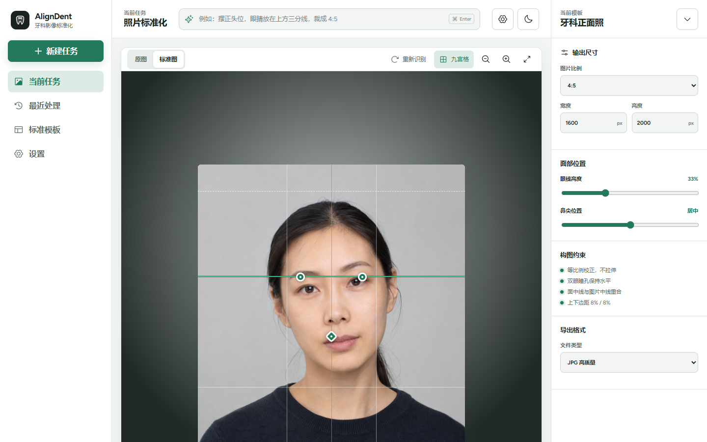

# AlignDent

**免费、源码公开、隐私优先的牙科正面照标准化工具。** 由 Zyls 发起并构建。

[](https://github.com/thomasgoh0826-sketch/AlignDent/releases/latest)
[](https://github.com/thomasgoh0826-sketch/AlignDent/releases/latest)
[](https://github.com/thomasgoh0826-sketch/AlignDent/actions/workflows/ci.yml)
[](LICENSE)



AlignDent 帮助牙医和诊所批量整理患者正面照片：自动摆正头位、统一构图并导出规格一致的新文件。照片默认只在本机处理，不上传云端，也不会覆盖原图。

## 直接下载

前往 **[最新版下载页面](https://github.com/thomasgoh0826-sketch/AlignDent/releases/latest)**，在 `Assets` 中下载最新版 `AlignDent-Setup-*-x64.exe`。

第一次使用请阅读：[Windows 下载与安装教程](docs/下载与安装.md)

> 当前安装包尚未购买 Windows 数字签名证书，首次运行可能出现“未知发布者”提示。请只从本仓库 Release 页面下载，并核对 Release 中公布的 SHA-256。

## Zyls 数字签名

`v0.1.1` 安装包带有 Zyls 自签名 Authenticode 签名和可信时间戳。公开证书随 Release 提供，证书指纹为：

`B2E06D26E190073DBE3181E08EC31325F09D123A`

自签名可以验证后续文件是否由同一 Zyls 密钥签署，但不等同于认证机构验证身份，Windows 仍可能显示未知发布者。不要为了运行软件把陌生自签名证书加入“受信任的根证书”。详见 [数字签名说明](SIGNING.md)。

## 它能做什么

- 识别双眼瞳孔、鼻尖与面部轮廓，自动摆正正面照。
- 保持左右瞳孔水平，面中线与图片中线重合。
- 只做旋转、等比例缩放和移动，不拉伸、不压扁人脸。
- 统一面部上缘与颌下留白，支持 1:1、4:5、3:4、2:3 模板。
- 支持单张、多张、文件夹和可直接访问的图片链接。
- 识别不确定时进入人工检查，可拖动左右瞳孔和鼻尖定位点。
- 批量导出到新文件夹，默认清除原始元数据，不覆盖原图。
- 中文自然语言设置默认离线解析；也可自行配置 OpenAI 兼容 API，且只发送文字指令。

## 隐私边界

- 核心人脸识别和图片处理完全在 Windows 本机完成。
- API 功能为可选项，只解析用户输入的文字，不发送照片、文件路径或患者信息。
- 演示图为虚构人物，不包含真实患者数据。
- 使用真实患者照片前，请遵守当地隐私法规和诊所内部授权流程。

## 使用方法

1. 导入照片或整个文件夹。
2. 选择比例与输出尺寸。
3. 点击“开始处理”，程序会自动摆正和统一构图。
4. 检查被标记的照片，必要时拖动三个定位点并确认。
5. 点击“导出”，选择新的输出文件夹。

## 本地开发

需要 Node.js 22+ 与 pnpm。

```powershell
pnpm install
pnpm test
pnpm run build
pnpm run test:e2e
pnpm run package:win
```

技术栈：Electron、React、TypeScript、MediaPipe、Sharp、Vitest、Playwright。

## 项目说明

AlignDent 是 Zyls 的公开实践项目：从真实工作需求出发，把隐私优先的本地 AI 做成普通人可以直接安装和使用的产品。如果它帮到了你，欢迎点一个 Star、提交问题或分享给牙科从业者。

本项目是图像整理工具，不提供医疗诊断，也不能替代专业判断。当前“头顶”使用稳定可识别的面部轮廓上缘作为构图依据；若工作规范要求精确到发丝最高点，应人工复核。

## 参与贡献

请阅读 [CONTRIBUTING.md](CONTRIBUTING.md)。安全或隐私问题请按照 [SECURITY.md](SECURITY.md) 私下报告。

## 使用许可与二创限制

© 2026 Zyls。源码可查看，官方原版可免费下载使用；未经书面许可，不得发布修改版、换皮版、衍生作品，不得再分发或转售。GitHub 服务自身允许的查看和 Fork 权利不受影响。完整条款见 [LICENSE](LICENSE)。

`v0.1.0` 曾短暂以 MIT 发布；已经合法获得该版本的人所取得的既有权利不能被追溯撤销。`v0.1.1` 起适用 Zyls Source-Available License 1.0。
