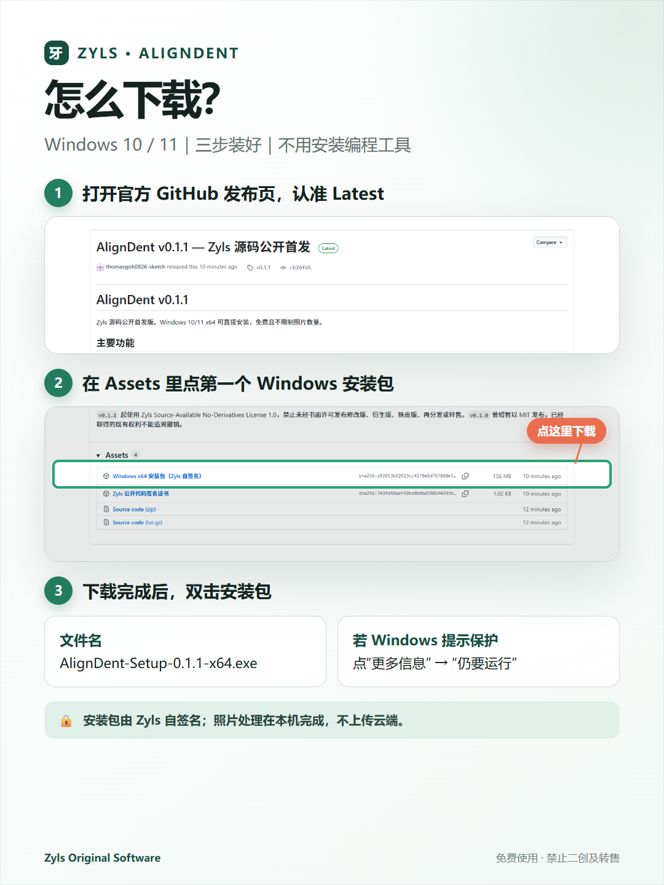
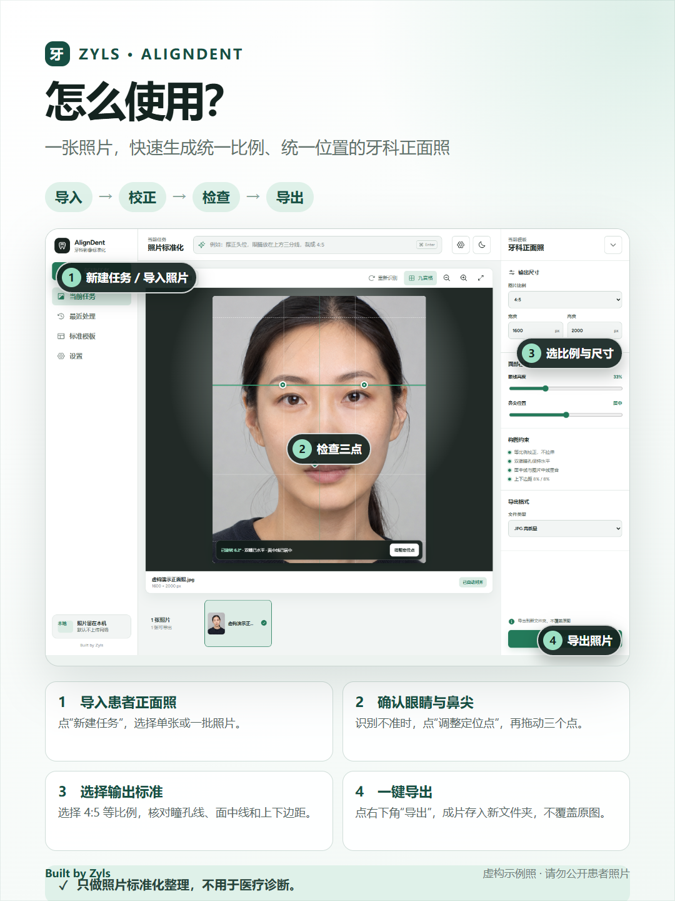

# AlignDent Windows 下载与安装教程

## 两张图看懂

### 下载与安装



### 照片标准化



## 一、下载

1. 打开 [AlignDent 最新版下载页面](https://github.com/thomasgoh0826-sketch/AlignDent/releases/latest)。
2. 找到页面下方的 **Assets**。
3. 点击最新版 `AlignDent-Setup-*-x64.exe`，等待下载完成。

不要从聊天群里的陌生网盘或第三方网站下载安装包。

## 二、安装

1. 双击下载的安装包。
2. 如果 Windows 显示“Windows 已保护你的电脑”，先确认文件来自本仓库，再点击“更多信息” → “仍要运行”。
3. 按安装向导选择目录并完成安装。
4. 从桌面或开始菜单打开 **AlignDent**。

出现提示是因为当前公开版本尚未购买受 Windows 信任的商业代码签名证书，不代表软件需要 VPS，也不代表照片会上传网络。

## 三、第一次处理照片

1. 点击“导入照片”或“导入文件夹”。
2. 选择输出比例与尺寸。
3. 点击“开始处理”。
4. 检查绿色瞳孔线、面中线和上下安全线。
5. 必要时点击“调整定位点”→“重新标记三点”，依次选择左瞳孔、右瞳孔和鼻尖。
6. 确认后点击“导出”，选择一个新的文件夹。

原始照片不会被覆盖。

## 四、核对安装包

Release 页面会公布 SHA-256。需要核对时，在安装包所在文件夹打开 PowerShell，运行：

```powershell
Get-FileHash .\AlignDent-Setup-0.1.2-x64.exe -Algorithm SHA256
```

显示的值应与 Release 页面完全一致。

也可以右键安装包 →“属性”→“数字签名”，核对签名者 `Zyls` 和证书指纹 `B2E06D26E190073DBE3181E08EC31325F09D123A`。这是自签名证书，Windows 不会默认信任；无需也不建议把它加入受信任根证书。

## 五、隐私提醒

- 核心识别和图片导出在本机完成。
- 不开启自定义 API 时不需要联网处理照片。
- 即使提交 GitHub 问题，也不要上传真实患者照片或个人资料。
